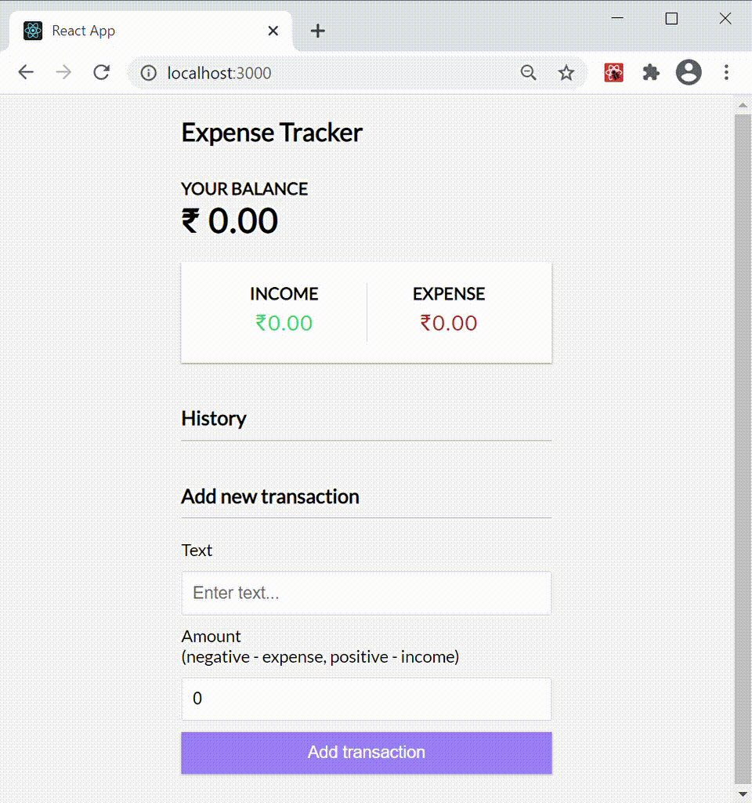

# Expense-Tracker

## Concepts learnt (React)

- Basics of React
- React Hooks
- Context API
- useState
- useReducer

## Concepts learnt (Express)

- How to create routes using `express.Router()`

## Concepts learnt (Node)

- How to create and use a custom API to interact with the MongoDB Atlas

## Concepts learnt (MongoDB)

- Mongoose Schema
